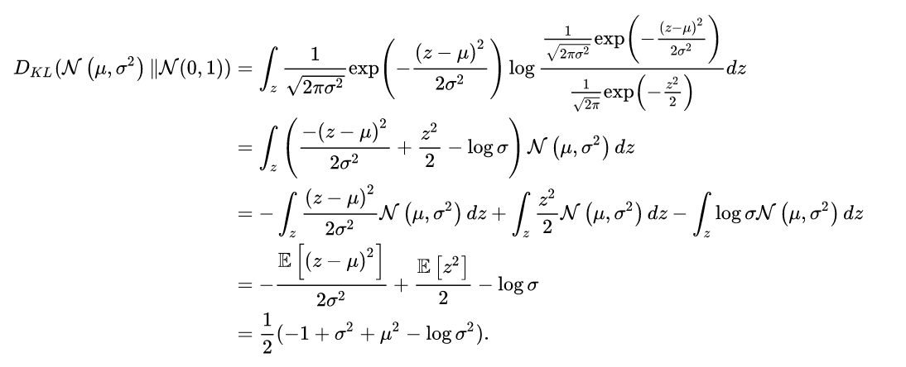

# Varational Auto-Ecoder(VAE)
## Vanilla VAE
### Autoencoder
自编码器类似于一个非线性的PCA，是一个利用神经网络来给复杂数据降维的模型
- Processs:
    Encode(x) -\> Z(latent)\-> Decoder(Z) 
- Loss fuction: || x - x*||^2
- Problem: can not be the generative model from random Z
- Reason: 
    1. not konw distribution of z~p(z) will generate the usefull X
    2. xi data point we have is limited

### Variational Autoencoder

给定一个简单的分布，将采样的空间缩的很小.N(0,I)Decoder输入一个从N(0,I)中采样得到的 z 其实是希望由参数化的Decoder能够学会一个映射，N(x,y^2)
比如说，我们的图片集可能是世界上所有的猫，那么抽样得到的一个可能代表颜色为橘色，耳朵为立耳的猫；而下次抽样得到的另一个可能代表颜色为白色，耳朵为折耳的猫。我们再假设，在这个下，这类立耳橘猫的图片像素值的分布服从一个多元高斯分布这样一来，我们的Decoder只需要通过神经网络，将变换为适当的我们就得到了这个多元高斯分布。之后我们就可以从中采样，得到立耳橘猫的图片了！
- Reparameterization Trick:
    - 采样函数: 采样函数不能够进行反向传播
        > 元素相乘操作  z = u + phi $ eror
- Empirical Lower Bound
    加入变分推断的思想，引入ELBO (Empirical Lower Bound)
    
    我们只需要最大化 l 就能最大化 log 并且最小化 KL
- Loss
    
    
    
    到这里，我们终于得到了在假设先验、后验、似然均是高斯分布的情况下，VAE最终的损失函数。值得一提的是，通常人们采用高斯分布只是因为其简便性。我们也可以根据数据的情况，假设更加复杂分布来推导、训练VAE。在这种情况下，VAE可能计算会更加复杂，但也可能会得到更强的表达能力。
    
Some reference material
1. [Tutorial on variational autoencoders](https://arxiv.org/pdf/1606.05908.pdf)
2. [Towards a Deeper Understanding of Variational Autoencoding Models](https://arxiv.org/pdf/1702.08658.pdf)
3. [Zhihu](https://zhuanlan.zhihu.com/p/348498294)
### Conditional Variational Autoencoder

### VQ-VAE [[Paper]](https://arxiv.org/pdf/1711.00937.pdf) [[Code]](https://github.com/deepmind/sonnet/blob/v2/sonnet/src/nets/vqvae.py)

- Self-define Highlight

- 将z离散化的关键vector quatization. 简单来说, 就是要先有一个codebook, 这个codebook是一个embedding table. 我们在这个table中找到和vector最接近(比如欧氏距离最近)的一个embedding, 用这个embedding的index来代表这个vector.
- Procedure
    1. CodeBook K * D table (e1,e2,e3,...)
    2. Encode(image) H\*W\*D **Ze(x)**
    3. find the cloest D number of H\*W vector correspondingly, represent by the index **q(z|x)**
    4. use the ei as input, reconstruct the image **Zq(x)** 
    > 从**Ze(x)**到**Zq(x)**这个变化可以看成一个聚类, 即把encoder得到的乱七八糟的向量用codebook里离它最近的一个embedding代表
- Loss
    
    1. 第一项用来训练encoder和decoder. 从上面图中的红线可以看出, bp的时候**Zq(x)** 的梯度直接copy给**Ze(x)**, 而不给codebook里的embedding, 所以这一项只训练encoder和decoder.
    2. 第二项叫codebook loss, 只训练codebook, 让codebook中的embedding向各自最近的**Ze(x)**靠近.
    3. 第三项叫commitment loss, 只训练encoder, 目的是encourage the output of encoder to stay close to the chosen codebook vector to prevent it from flucturating too frequently from one code vector to another, 即防止encoder的输出频繁在各个codebook embedding之间跳.
- 到这, VQ-VAE的训练就搞定了. 但是前面我们说到, VAE的目的是训练完成后, 丢掉encoder, 在prior上直接采样, 加上decoder就能生成. 如果我们现在独立地采H*W个z, 然后查表得到维度为的H\*W\*D的**Zq(x)**, 那么生成的图片在空间上的每块区域之间几乎就是独立的. 因此我们需要让各个 z 之间有关系, 因此用PixelCNN, 对这些 z 建立一个autoregressive model: p(z1,z2,z3,z4) = p(z1)p(z2|z1)p(z3|z1.z2)...., 这样就可以进行ancestral sampling, 得到一个互相之间有关联的H*W的整数矩阵;   p(z1,z2,z3,z4)这个联合概率即为我们想要的prior.

Reflaction:
1. VAE contious laten z < > VQ-VAE descrete which more adaptive in modeling world.
> eg: 图片里某个object会覆盖很多pixel, 音频中一个phoneme会持续很多samples/frames, 而不会去学一些特别细节的东西.

Question:
1. PixelCNN [[Paper]](https://arxiv.org/pdf/1606.05328.pdf)[[Link]]()
2. Experiment and code

### VQ-VAE-2 [[Paper]](https://arxiv.org/pdf/1906.00446.pdf)[[Code]](https://github.com/deepmind/sonnet)